<architecture_analysis>
1. Komponenty wymienione w specyfikacjach:
- `PublicLayout.astro`, `Layout.astro`, `Header.tsx`.
- Formularze React: `SignInForm.tsx`, `SignUpForm.tsx`, `RecoverPasswordForm.tsx`, `ResetPasswordForm.tsx`, `AuthFormLayout.tsx`, `FormField.tsx`, `PasswordStrengthMeter.tsx`.
- Strony Astro: `/` (landing), `/auth/signin`, `/auth/signup`, `/auth/recover`, `/auth/reset`, `/auth/confirm`, `/recipes`, `/profile`.
- Komponenty wspierające: `ProfileCompletionPrompt.tsx`, `fetchWithAuth` (`src/lib/api.ts`).
- Middleware i backend: `middleware/index.ts`, API `POST /api/auth/signin`, `POST /api/auth/signup`, `POST /api/auth/recover`, `POST /api/auth/reset`, `POST /api/auth/logout`, `GET/PUT /api/profile`, `GET /api/auth/confirm`.
- Integracje: Supabase Auth, serwis profilu (`profile.service.ts`), moduł analityki (`emitAnalyticsEvent`).

2. Główne strony i odpowiadające komponenty:
- Strona landing (`/`) korzysta z `PublicLayout.astro` i przekierowuje zalogowanych do `/recipes`.
- Strona logowania (`/auth/signin`) renderuje `SignInForm.tsx` wewnątrz `PublicLayout.astro`.
- Strona rejestracji (`/auth/signup`) renderuje `SignUpForm.tsx` (z licznikiem siły hasła) w `PublicLayout.astro`.
- Strony odzyskiwania i resetu hasła (`/auth/recover`, `/auth/reset`) używają odpowiednich formularzy React w `PublicLayout.astro`.
- Strona potwierdzenia (`/auth/confirm`) sprawdza token i przekierowuje po sukcesie.
- Strefa chroniona (`/recipes*`, `/profile`) używa rozszerzonego `Layout.astro` z `Header.tsx`, `ProfileCompletionPrompt.tsx` i widokami przepisów/profilu.

3. Przepływ danych między komponentami:
- Formularze React walidują dane lokalnie, blokują duplikaty i wysyłają żądania `fetch` do odpowiednich endpointów API.
- Endpointy API korzystają z `locals.supabase` do wywołań Supabase Auth, tworzą/aktualizują profil przez `profile.service.ts` oraz emitują zdarzenia analityczne.
- Supabase ustawia ciasteczka sesji, które middleware odczytuje i dołącza jako `locals.session`, sterując dostępem do stron i API.
- `Layout.astro` i `Header.tsx` korzystają z `locals.session`, zapewniając nawigację, menu użytkownika i wylogowanie (wywołanie `/api/auth/logout`).
- `fetchWithAuth` przechwytuje status 401 z API, informuje o wygaśnięciu sesji i przekierowuje do logowania.
- Strony przepisów i profilu pobierają dane z API po uwierzytelnieniu i korzystają z `ProfileCompletionPrompt.tsx` do prośby o uzupełnienie preferencji.

4. Opis funkcjonalności komponentów:
- `PublicLayout.astro`: wspólny układ publicznych stron z CTA logowania/rejestracji i automatycznym przekierowaniem zalogowanych użytkowników.
- `Layout.astro`: główny układ strefy chronionej z nawigacją, slotem treści i integracją danych sesji.
- `Header.tsx`: menu użytkownika z linkami do `Recipes`, `Profile` i akcją wylogowania.
- `SignInForm.tsx`: formularz logowania z walidacją, obsługą błędów i przekierowaniem po sukcesie.
- `SignUpForm.tsx`: formularz rejestracji z wykrywaniem strefy czasowej, miernikiem siły hasła i automatycznym logowaniem.
- `RecoverPasswordForm.tsx`: inicjowanie resetu hasła z neutralnym komunikatem zwrotnym.
- `ResetPasswordForm.tsx`: ustawienie nowego hasła na podstawie tokenu i walidacji bezpieczeństwa.
- `AuthFormLayout.tsx`: wspólna ramka wizualna kart formularzy (tytuły, stopki, spójne CTA).
- `FormField.tsx`: bazowy komponent pól formularza z obsługą błędów i stanów.
- `PasswordStrengthMeter.tsx`: wizualny wskaźnik złożoności hasła.
- `ProfileCompletionPrompt.tsx`: zachęca nowych użytkowników do uzupełnienia profilu po rejestracji.
- `middleware/index.ts`: tworzy klienta Supabase na serwerze, odczytuje sesję i wymusza przekierowania zależnie od uwierzytelnienia.
- API auth/profile: przyjmują dane z formularzy, weryfikują przez Zod, integrują z Supabase i serwisem profili, emitują zdarzenia (`user_registered`, `user_signin`, `user_signout`, `profile_updated`).
- `fetchWithAuth`: klient `fetch` z obsługą wygaśniętej sesji.
- Supabase Auth: zarządza kontami, sesjami, odzyskiwaniem haseł i potwierdzeniami emaili (opcjonalnie).

```mermaid
flowchart TD
    subgraph UI_Publiczne["Warstwa UI - strefa publiczna"]
        LandingPage["Strona startowa `/`"]
        SignInPage["Strona logowania `/auth/signin`"]
        SignUpPage["Strona rejestracji `/auth/signup`"]
        RecoverPage["Strona odzyskiwania `/auth/recover`"]
        ResetPage["Strona resetu `/auth/reset`"]
        ConfirmPage["Strona potwierdzenia `/auth/confirm`"]
        PublicLayout["PublicLayout.astro"]
    end

    subgraph Formularze["Komponenty formularzy (React)"]
        SignInForm["SignInForm.tsx"]
        SignUpForm["SignUpForm.tsx"]
        RecoverForm["RecoverPasswordForm.tsx"]
        ResetForm["ResetPasswordForm.tsx"]
        AuthLayout["AuthFormLayout.tsx"]
        FormField["FormField.tsx"]
        PasswordMeter["PasswordStrengthMeter.tsx"]
    end

    subgraph UI_Chronione["Warstwa UI - strefa chroniona"]
        AppLayout["Layout.astro"]
        Header["Header.tsx"]
        RecipesPages["Strony przepisów (/recipes…)"]
        ProfilePage["Strona profilu `/profile`"]
        ProfilePrompt["ProfileCompletionPrompt.tsx"]
    end

    subgraph MiddlewareLayer["Middleware i klient"]
        Middleware["middleware/index.ts"]
        FetchWithAuth["fetchWithAuth (lib/api)"]
    end

    subgraph API["Warstwa API Astro"]
        ApiSignIn["POST /api/auth/signin"]
        ApiSignUp["POST /api/auth/signup"]
        ApiRecover["POST /api/auth/recover"]
        ApiReset["POST /api/auth/reset"]
        ApiLogout["POST /api/auth/logout"]
        ApiConfirm["GET /api/auth/confirm"]
        ApiProfile["GET/PUT /api/profile"]
    end

    subgraph Backend["Supabase i serwisy"]
        SupabaseAuth["Supabase Auth"]
        ProfileService["profile.service.ts"]
        Analytics["emitAnalyticsEvent"]
    end

    LandingPage --> PublicLayout
    SignInPage --> PublicLayout
    SignUpPage --> PublicLayout
    RecoverPage --> PublicLayout
    ResetPage --> PublicLayout
    ConfirmPage --> PublicLayout

    SignInPage --> SignInForm
    SignUpPage --> SignUpForm
    RecoverPage --> RecoverForm
    ResetPage --> ResetForm

    SignInForm --> AuthLayout
    SignInForm --> FormField
    SignUpForm --> AuthLayout
    SignUpForm --> FormField
    SignUpForm --> PasswordMeter
    RecoverForm --> AuthLayout
    RecoverForm --> FormField
    ResetForm --> AuthLayout
    ResetForm --> FormField
    ResetForm --> PasswordMeter

    SignInForm -->|"POST dane logowania"| ApiSignIn
    SignUpForm -->|"POST rejestracja + strefa czasowa"| ApiSignUp
    RecoverForm -->|"POST email"| ApiRecover
    ResetForm -->|"POST nowe hasło"| ApiReset
    Header -->|"klik \"Wyloguj\""| ApiLogout
    ConfirmPage -->|"GET token"| ApiConfirm
    FetchWithAuth -->|"żądania chronione"| ApiProfile
    RecipesPages -->|"pobierz profil"| FetchWithAuth

    ApiSignIn -->|"weryfikacja"| SupabaseAuth
    ApiSignUp -->|"tworzy konto"| SupabaseAuth
    ApiRecover -->|"wysyła token"| SupabaseAuth
    ApiReset -->|"aktualizuje hasło"| SupabaseAuth
    ApiConfirm -->|"verify OTP"| SupabaseAuth
    ApiSignUp -->|"inicjalizuje profil"| ProfileService
    ApiProfile -->|"czyta/aktualizuje"| ProfileService
    ProfileService -->|"profile_updated"| Analytics
    ApiSignUp -->|"user_registered"| Analytics
    ApiSignIn -->|"user_signin"| Analytics
    ApiLogout -->|"user_signout"| Analytics

    SupabaseAuth -->|"ustawia ciasteczka"| Middleware
    Middleware -->|"locals.session"| AppLayout
    Middleware -->|"guarduje dostęp"| RecipesPages
    Middleware -->|"redirect"| SignInPage
    AppLayout --> Header
    AppLayout --> RecipesPages
    AppLayout --> ProfilePage
    ProfilePage --> ProfilePrompt
    Middleware -->|"locals.session"| PublicLayout
    FetchWithAuth -->|"401 => redirect"| SignInPage

    classDef updated fill:#FFE0B2,stroke:#E65100,stroke-width:1px;
    classDef shared fill:#E3F2FD,stroke:#1565C0,stroke-width:1px;
    class PublicLayout,SignInForm,SignUpForm,RecoverForm,ResetForm,AuthLayout,FormField,PasswordMeter,AppLayout,Header,Middleware,FetchWithAuth,ApiSignIn,ApiSignUp,ApiRecover,ApiReset,ApiLogout,ApiConfirm,Analytics updated;
    class AuthLayout,FormField,PasswordMeter shared;
```

</architecture_analysis>

<mermaid_diagram>

</mermaid_diagram>

