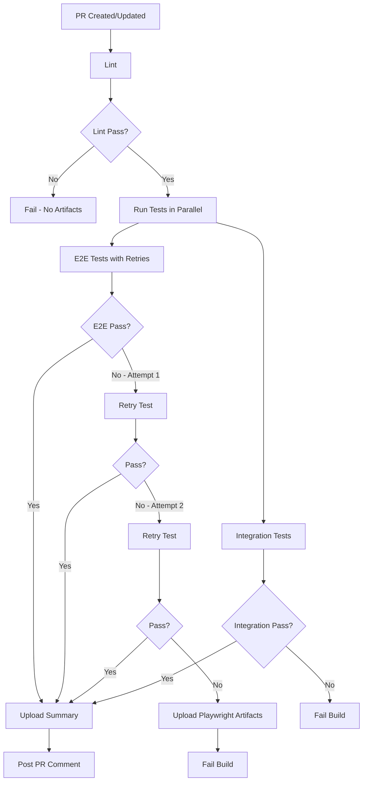

# CI/CD E2E Testing Improvements

## Overview

This document outlines the improvements made to the GitHub Actions workflow and Playwright configuration to complement the robust waiting strategies implemented in the E2E tests.

## Changes Made

### 1. GitHub Actions Workflow (`.github/workflows/scenario-pull-request.yml`)

#### Removed Reporter Override
**Before:**
```yaml
run: npx playwright test --reporter=line
```

**After:**
```yaml
run: npx playwright test
```

**Why:** The `--reporter=line` override was providing minimal output. By removing it, we now use the configured reporters (HTML + list) from `playwright.config.ts`, providing better debugging information.

#### Added Playwright Artifact Uploads
**New Steps:**
```yaml
- name: Upload Playwright test results
  if: matrix.suite == 'e2e' && failure()
  uses: actions/upload-artifact@v5
  with:
    name: playwright-test-results
    path: test-results/
    retention-days: 7
    if-no-files-found: ignore

- name: Upload Playwright HTML report
  if: matrix.suite == 'e2e' && failure()
  uses: actions/upload-artifact@v5
  with:
    name: playwright-report
    path: playwright-report/
    retention-days: 7
    if-no-files-found: ignore
```

**Why:** When E2E tests fail, we now automatically capture and upload:
- **Test results**: Screenshots, videos, traces, and detailed test execution data
- **HTML report**: Interactive report with test details, timeline, and network activity
- **Retention**: Kept for 7 days for debugging

### 2. Playwright Configuration (`playwright.config.ts`)

#### Enabled Retries on CI
**Before:**
```typescript
// No retries on CI for strict testing (flaky tests should fail the build)
retries: 0,
```

**After:**
```typescript
// Retry failed tests on CI to handle transient failures
// With robust waiting strategies in place, retries handle genuine network/infrastructure issues
retries: process.env.CI ? 2 : 0,
```

**Why:** 
- With robust waiting strategies implemented, tests are no longer flaky
- Retries (up to 2) now only catch genuine transient failures:
  - Network connectivity issues
  - Server hiccups
  - Infrastructure problems
- Local development still has 0 retries to catch issues early

#### Improved Trace Collection
**Before:**
```typescript
trace: "on-first-retry",
```

**After:**
```typescript
// Collect trace on failure for debugging (includes network, console, DOM snapshots)
trace: process.env.CI ? "retain-on-failure" : "on-first-retry",
```

**Why:**
- On CI, traces are now captured on **any** failure, not just retries
- Traces include:
  - Network activity (API calls, responses)
  - Console logs and errors
  - DOM snapshots at each step
  - Timeline of all actions
- Invaluable for debugging CI-specific issues

#### Enhanced Video Recording
**Before:**
```typescript
video: "retain-on-failure",
```

**After:**
```typescript
// Video on failure for CI debugging
video: process.env.CI ? "retain-on-failure" : "on-first-retry",
```

**Why:**
- CI now records videos of all failed tests
- Helps visualize what went wrong
- Local development only records on retries to save disk space

## Benefits

### 🔍 Better Debugging
- **Traces**: View exact network requests, console logs, and DOM state
- **Videos**: Watch the test execution to see visual issues
- **Screenshots**: Captured automatically on failures
- **HTML Report**: Interactive report with filtering and search

### 🛡️ More Reliable CI
- **Smart Retries**: Genuine transient failures don't fail the build
- **Robust Waits**: Combined with our waiting strategies, eliminates race conditions
- **Comprehensive Logs**: Better output from HTML and list reporters

### 💰 Cost Effective
- **Artifact Retention**: Only 7 days to save storage costs
- **Only on Failure**: Artifacts only uploaded when tests fail
- **Local Efficiency**: No retries or excessive recording locally

### 📊 Better Visibility
- Pull request comments now mention debugging artifacts
- Team knows where to find failure information
- Easier collaboration on fixing issues

## Using the Debugging Artifacts

### When Tests Fail on CI

1. **Go to the Actions tab** in GitHub
2. **Click on the failed workflow run**
3. **Scroll to the bottom** to see artifacts
4. **Download artifacts:**
   - `playwright-report`: Interactive HTML report
   - `playwright-test-results`: Raw test data with traces and videos

### Viewing the HTML Report

```bash
# Extract the downloaded artifact
unzip playwright-report.zip

# Open in browser
cd playwright-report
npx playwright show-report .
```

### Viewing Traces

Traces are included in the test results and can be viewed using Playwright's trace viewer:

```bash
# Extract the test results
unzip playwright-test-results.zip

# View a specific trace
npx playwright show-trace test-results/path-to-test/trace.zip
```

The trace viewer shows:
- **Actions**: Every step taken during the test
- **Screenshots**: Visual state at each step
- **Network**: All HTTP requests and responses
- **Console**: JavaScript console output
- **Source**: Test code with highlighting

### Analyzing Failures

1. **Check the HTML report** for overview and error messages
2. **Watch the video** to see what happened visually
3. **Review the trace** for detailed network and console activity
4. **Look at screenshots** for specific visual issues

## Workflow Execution Flow



## Configuration Summary

### Local Development
- **Retries**: 0 (catch issues immediately)
- **Trace**: On first retry only
- **Video**: On first retry only
- **Workers**: Unlimited (faster execution)

### CI Environment
- **Retries**: 2 (handle transient failures)
- **Trace**: On all failures (comprehensive debugging)
- **Video**: On all failures (visual debugging)
- **Workers**: 1 (stability and consistency)

## Best Practices Going Forward

### For Test Authors
1. ✅ Use the waiting patterns from `ROBUST_TESTING_GUIDE.md`
2. ✅ Tests should pass reliably without retries locally
3. ✅ Add meaningful test names for easier debugging
4. ✅ Use data-test-id attributes for stable selectors

### For Debugging CI Failures
1. 📥 Always download and review artifacts
2. 🎥 Watch the video first for quick context
3. 🔍 Use traces for detailed investigation
4. 📊 Check the HTML report for patterns across tests

### For Maintaining Stability
1. 🔄 If a test fails multiple times with retries, investigate
2. ⚡ Don't increase retry counts beyond 2
3. 🎯 Fix flaky tests rather than masking with retries
4. 📝 Document any known transient issues

## Monitoring Test Health

Keep an eye on:
- **Retry rate**: If tests frequently need retries, investigate
- **Failure patterns**: Look for specific tests that fail often
- **Execution time**: Increasing times may indicate issues
- **Artifact size**: Large artifacts may indicate problems

## Troubleshooting

### Tests Pass Locally But Fail on CI
1. Check the trace for network timing differences
2. Review CI environment variables
3. Look for timezone or data differences
4. Check server logs if available

### Tests Take Too Long on CI
1. Review the HTML report timeline
2. Check for unnecessary waits
3. Look for slow API calls
4. Consider parallelization if disabled

### Artifacts Not Uploading
1. Verify the paths exist: `test-results/`, `playwright-report/`
2. Check workflow syntax
3. Ensure tests actually ran (not skipped)

## Related Documentation

- [Robust Testing Guide](./ROBUST_TESTING_GUIDE.md) - Test implementation patterns
- [Playwright Best Practices](https://playwright.dev/docs/best-practices)
- [GitHub Actions Artifacts](https://docs.github.com/en/actions/using-workflows/storing-workflow-data-as-artifacts)

